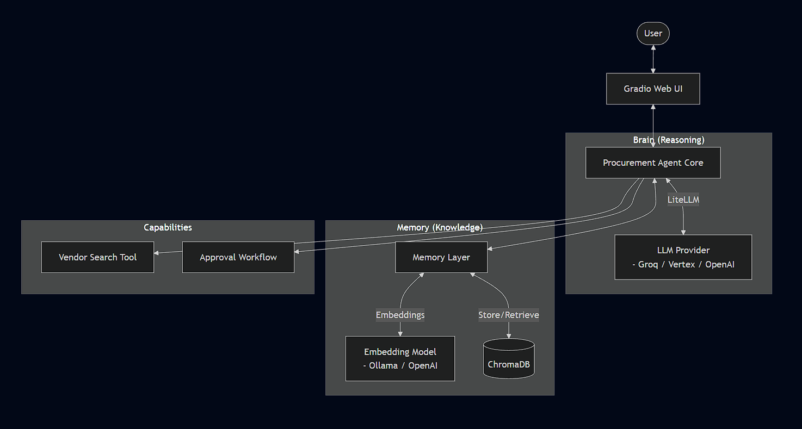
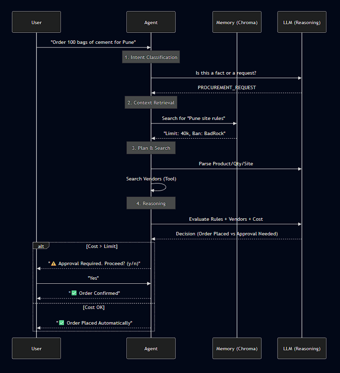

# Intelligent Procurement Agent

A Retrieval-Augmented Generation (RAG) agent designed for construction site managers. It intelligently handles procurement requests, enforces site-specific rules, and manages vendor selection using a Human-in-the-Loop (HITL) workflow.

## 🏗️ Architecture

The system uses a modular architecture allowing you to mix and match LLM providers (Groq, Vertex AI) and Embedding providers (Ollama, OpenAI, Vertex AI).



## 🔄 Request Flow

When you send a message, the agent processes it through the following pipeline:



## ✨ Features

-   **Modular Configuration**: easily switch providers in `.env`.
    -   *Example*: Use **Groq** for fast reasoning and **Ollama** for free local embeddings.
-   **Persistent Memory**: Uses **ChromaDB** to store and retrieve site rules (e.g., "Don't use Vendor X").
-   **Multi-Provider Support**: Supports **Vertex AI**, **OpenAI**, and **Ollama** for embeddings.
-   **Human-in-the-Loop**: Automatically pauses for approval if a request violates soft rules (like budget limits).
-   **Web Interface**: Built with **Gradio**, featuring:
    -   Chat Interface
    -   Live Reasoning Panel (see the agent's thought process)
    -   Knowledge Base Viewer (see what the agent knows)

## 📂 Project Structure
```text
C:\Users\AjinkyaBahirat\CloudRedux_Task\
├── .env                     # Local secrets (API Keys, Provider selection)
├── app.py                   # Gradio Web UI Entry Point
├── requirements.txt         # Python dependencies
├── README.md                # Documentation
├── src/
│   ├── agent.py             # Google ADK Agent Definition
│   ├── memory.py            # ChromaDB Memory Layer
│   ├── tools.py             # Tools (Vendor Search)
│   └── config.py            # Configuration Loader
└── mock_vendors.json    # Vendor data file
```

## 🧠 Internal Architecture

### How Memory/Retrieval Works
The agent uses **ChromaDB** as a persistent vector store to enable Long-Term Memory (LTM).
1.  **Ingestion**: When the user provides a fact (e.g., "Max budget is 500"), the `MemoryLayer` embeds this text using `litellm` (supporting OpenAI, Vertex, or Ollama) and stores the vector in ChromaDB.
2.  **Retrieval**: During a procurement request, the agent calls the `consult_memory_tool`. This queries ChromaDB for semantic matches (e.g., "site rules") and returns relevant text snippets to the agent's context window, allowing it to make informed decisions.

### Pause/Resume & Human-in-the-Loop (HITL)
Google ADK handles the conversation flow, but we implement a custom HITL workflow for high-value transactions:
1.  **Detection**: The agent's instructions specify that if a limit is exceeded (checked against memory), it must return a JSON status: `"PAUSE_APPROVAL_NEEDED"`.
2.  **State Management**: The `ADKProcurementAgent` wrapper intercepts this status in `process_message`. It temporarily saves the proposed order in `self.pending_order` (in-memory state).
3.  **Resume**: On the next user turn, if `pending_order` exists, the agent bypasses the LLM processing and interprets the user's input as an approval or rejection, executing the order or resetting the state accordingly.

## 🚀 Setup & Usage

### 1. Prerequisites
-   Python 3.10+
-   API Key for your chosen LLM (Groq, OpenAI, or Google Cloud Project).

### 2. Installation
```bash
pip install -r requirements.txt
```

### 3. Configuration
1.  Copy `.env.example` to `.env`:
    ```bash
    cp .env.example .env
    ```
2.  Edit `.env` to set your providers.
    -   **For Groq + Ollama (Free/Cheap)**:
        ```ini
        LLM_PROVIDER=groq
        LLM_MODEL_NAME=llama3-70b-8192
        GROQ_API_KEY=gsk_...
        
        EMBEDDING_PROVIDER=ollama
        EMBEDDING_MODEL_NAME=nomic-embed-text
        OLLAMA_API_BASE=http://localhost:11434
        ```
    -   **For Vertex AI**:
        ```ini
        LLM_PROVIDER=vertex_ai
        LLM_MODEL_NAME=gemini-1.5-pro
        EMBEDDING_PROVIDER=vertex_ai
        EMBEDDING_MODEL_NAME=text-embedding-004
        ```

### 4. Run the Application
Start the Web UI:
```bash
python app.py
```
Open your browser at `http://127.0.0.1:7860`.

### 5. Interaction Examples
-   **Teach**: "For the Mumbai site, the spending limit is 10,000 INR."
-   **Order**: "Order 50 bags of cement for Mumbai."
-   **Approval**: If the order costs 15,000 INR, the agent will ask for your confirmation.
